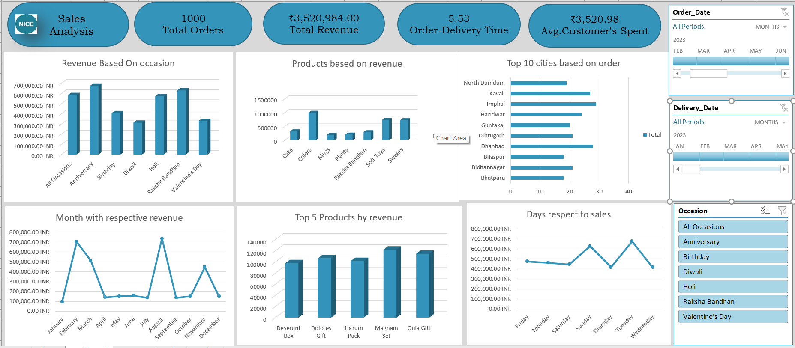

# 📊 Sales Dashboard Project

## 📌 Overview
This project presents a sales dashboard built to analyze business performance and generate key insights.

## 🛠 Tools Used
- Microsoft Excel

## 📁 Files Included
- sales_dashboard.xlsx → Dashboard file
- summary.pdf → Project explanation

## 📈 Key Insights
- Sales performance across different regions
- Top-performing products
- Monthly trends and patterns

## 🎯 Purpose
The goal of this project is to practice data analysis and visualization skills.

## 📸 Dashboard Preview

## 👤 Author
Sakshyam Bhandari
